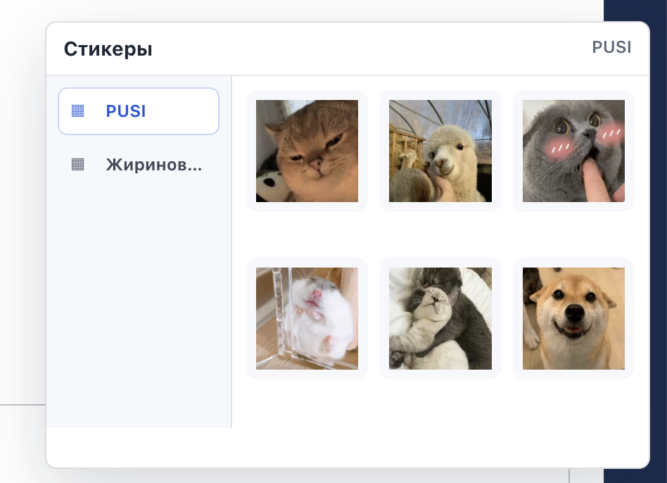

# Band Mattermost Stickers



Chrome-расширение для Mattermost на `https://band.wb.ru`: добавляет кнопку стикеров внутрь панели действий поля ввода, между emoji picker и загрузкой файлов, и позволяет прикреплять стикер из локальных стикерпаков.

## Что внутри

- `manifest.json` — Chrome Extension Manifest V3, ограничен доменом `https://band.wb.ru/*`.
- `src/stickers.js` — список доступных стикерпаков и файлов.
- `src/content.js` — встраивает кнопку между emoji и upload, показывает папки стикерпаков и передает стикер в композер Mattermost.
- `src/styles.css` — стили панели.
- `stickers/PUSI/` — первый стикерпак, 27 поддерживаемых WebP/PNG.
- `stickers/ASIA/` — стикерпак ASIA, 16 WebP.
- `stickers/MONIKA/` — стикерпак MONIKA, 17 WebP.
- `stickers/KONKURENTY/` — стикерпак Конкуренты, 2 WebP.
- `stickers/ZHIRINOVSKIY/` — второй стикерпак в формате WebP.
- `stickers_128/` — маленькие PNG-версии стикеров 128x128 для отправки по умолчанию.
- `DESIGN.md` — правила размещения кнопки, иконки и панели выбора.
- `docs/index.html` — лаконичная HTML-документация.

## Установка для разработки

1. Откройте `chrome://extensions`.
2. Включите `Developer mode`.
3. Нажмите `Load unpacked`.
4. Выберите папку проекта `extantion_band`.
5. Откройте `https://band.wb.ru` и перейдите в любой канал Mattermost.

Расширение не запрашивает лишние разрешения и работает только на домене `band.wb.ru`.

## Использование

1. Поставьте курсор в поле отправки сообщения Mattermost.
2. Нажмите кнопку стикеров между emoji picker и загрузкой файлов.
3. Выберите `Популярные` или папку стикерпака слева и стикер справа.
4. По умолчанию отправляется маленький стикер 128x128. Если включить `bigstic`, отправится оригинальный размер.
5. Если включена опция `Моментальная отправка`, стикер будет сразу отправлен в переписку. Если опцию выключить, стикер останется вложением в композере.

Панель также открывается и закрывается горячей клавишей `Command + Option + S`.

## Добавление стикеров

1. Положите WebP/PNG/JPG файл в папку стикерпака, например `stickers/PUSI/new_sticker.webp` или `stickers/PUSI/new_sticker.png`.
2. Добавьте запись в `src/stickers.js`:

```js
{
  id: "pusi-new",
  title: "PUSI New",
  path: "stickers/PUSI/new_sticker.webp",
  smallPath: "stickers_128/PUSI/new_sticker.png"
}
```

3. Сгенерируйте PNG 128x128 в `stickers_128/<PACK_NAME>/`.
4. Если создается новый стикерпак, добавьте его объект в `window.BAND_STICKER_PACKS`. Панель автоматически покажет его как отдельную папку.
5. Добавьте оригинал и `smallPath` в `web_accessible_resources` в `manifest.json`.
6. Перезагрузите расширение на странице `chrome://extensions`.

Для путей к файлам используйте ASCII-имена папок, например `stickers/ZHIRINOVSKIY/`. Кириллица и комбинированные Unicode-символы могут не совпасть с `web_accessible_resources` в Chrome.

Формат `.tgs` сейчас не подключается: для него нужен отдельный рендер Lottie в PNG/WebP.

## Технические заметки

Расширение использует `MutationObserver`, потому что Mattermost работает как SPA и может перерисовывать композер при переходе между каналами. Монтаж кнопки ищет `emojiPickerButton` и кнопку загрузки файлов, затем вставляет кнопку стикеров между ними. Панель выбора добавляется в `document.body` и позиционируется около кнопки, чтобы контейнер поля ввода Mattermost не обрезал попап. Открытие привязано к `pointerdown`, а не только к `click`, чтобы toolbar Mattermost не перехватывал действие. Горячая клавиша `Command + Option + S` обрабатывается на уровне страницы и игнорирует повтор при удержании клавиш. Первая вкладка `Популярные` строится из локальной статистики использования в `localStorage`: выше показываются часто и недавно отправленные стикеры. По умолчанию отправляется `smallPath` 128x128; чекбокс `bigstic` переключает отправку на оригинальный `path`. Перед загрузкой WebP-исходники конвертируются в PNG через Canvas, потому что Mattermost чаще принимает PNG как обычное вложение. На время прикрепления файла расширение добавляет в композер невидимый символ `U+200B`, отправляет `input`-событие и сразу удаляет символ обратно. Это обходит ошибку Mattermost для вложений без текста. Для передачи файла сначала используется штатный `input[type="file"]`, если он есть в DOM. Затем дополнительно отправляется набор событий `dragenter`, `dragover`, `drop` и `paste`; если Mattermost не примет файл, включается fallback через Clipboard API.

## Документация

Откройте [docs/index.html](docs/index.html) в браузере, чтобы посмотреть схему работы и текущий состав стикерпака.
